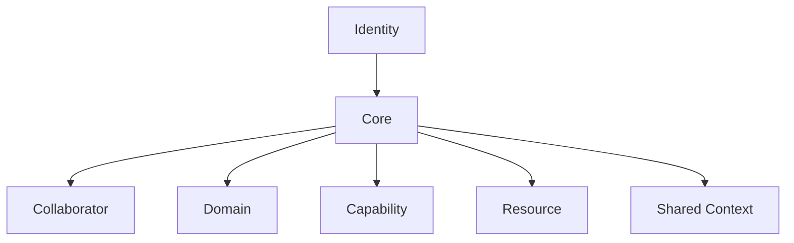
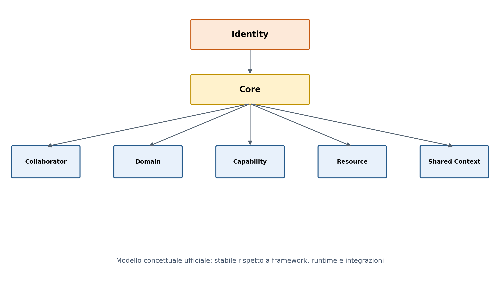

# GAIA

> Local-first Personal AI Operating System

## Document recovery status

- **Document:** `README.md`
- **Recovery approach:** conservative reconstruction
- **Source basis:** surviving GAIA reference documents, repository-structure specification, Sprint 1/Sprint 2 document inventory, and architecture discussion material
- **Confidence:** high for identity, document roles, repository structure, project phase and declared principles; no claim of byte-for-byte recovery of the lost README
- **Rule applied:** this README introduces and navigates the project. It does not replace the detailed content of `IDENTITY.md`, `GAIA_MODEL.md`, `MANIFESTO.md`, Sprint documents or ADRs.

## What GAIA is

GAIA is a **local-first Personal AI Operating System**.

It is intended to become a personal ecosystem of specialised digital collaborators that helps its owner:

- reduce unnecessary cognitive load;
- coordinate work and context;
- retain useful information intentionally;
- interact with digital and physical systems through explicit capabilities;
- preserve human authority over important decisions and sensitive actions;
- evolve over many years without becoming dependent on a single model, framework, runtime, interface or integration.

GAIA is personal first. Its initial relationship is with a single owner, who remains the source of authority and final decision-maker for important outcomes.

GAIA is local-first not only as a deployment preference, but as a statement about ownership, resilience, privacy, inspectability and control. External and cloud services may be used where they provide value, but they should remain explicit, bounded and replaceable whenever practical.

## What GAIA is not

GAIA is not defined as:

- another chatbot;
- a generic agent framework;
- a workflow automation product;
- a Home Assistant dashboard;
- a model-provider wrapper;
- a cloud assistant;
- a single-purpose Telegram bot;
- a collection of unrelated scripts;
- a plugin marketplace;
- an autonomous replacement for human judgement.

Conversation, workflows, agents, local models, cloud models, memory, automation and external tools may all participate in GAIA. None of them, individually, define its identity.

## Stable identity

The stable identity statement is:

> GAIA is a local-first Personal AI Operating System: a personal ecosystem of specialised digital collaborators that helps the user reduce cognitive load, coordinate context, and act through explicit capabilities while keeping important decisions under human control.

The normative identity document is [`reference/IDENTITY.md`](reference/IDENTITY.md).

## Why the project exists

Personal AI should become useful personal infrastructure rather than disposable interaction.

GAIA starts from several concerns:

- useful AI should not require the user to surrender ownership or control;
- memory should not become accidental accumulation;
- fluent language should not hide important decisions or failures;
- action should be bounded by explicit capability and approval semantics;
- extensibility should not become an uncontrolled collection of plugins and integrations;
- a system maintained by a very small team must remain understandable and recoverable;
- technologies will change, so project identity must remain more stable than implementation.

The foundational declaration is maintained in [`reference/MANIFESTO.md`](reference/MANIFESTO.md).

## Design principles

The current work is guided by these durable principles:

1. **Human First** - important actions and sensitive decisions remain visible, governable and correctable.
2. **Local First** - prefer local ownership, control and execution whenever practical. Cloud use must be explicit and replaceable.
3. **Simplicity** - complexity must be justified by validated value.
4. **Replaceability** - models, frameworks, runtimes, channels and integrations must remain replaceable where possible.
5. **Bounded Responsibility** - collaborators and domains need clear scope.
6. **Explicit Capability** - authority must not be implied only by a prompt.
7. **Memory With Intent** - remembered information must be inspectable, correctable and forgettable.
8. **Observability** - important interpretation, retrieval, approval, execution, denial and failure must be understandable.
9. **Sustainable Complexity** - the system must remain maintainable by a very small team.
10. **Identity Over Implementation** - architecture and technology must serve GAIA's identity, not redefine it.
11. **Reuse Before Build** - when a suitable external technology already solves a bounded problem, evaluate reuse before creating GAIA-specific infrastructure. Adoption remains a separate evidence and governance decision; an external tool must not become GAIA architecture merely by being used.

The detailed principles are maintained in [`reference/DESIGN_PRINCIPLES.md`](reference/DESIGN_PRINCIPLES.md).

## Current project phase

GAIA is in a **bounded architecture-validation and implementation phase**.

The project has deliberately not committed to a final:

- architecture beyond the decisions explicitly accepted in ADRs;
- implementation language;
- agent or orchestration framework;
- runtime abstraction;
- storage model;
- memory architecture;
- planner model;
- plugin model;
- production deployment model.

This remains intentional. Completed bounded milestones provide implementation and validation evidence, but do not automatically establish broader architecture. New implementation work must remain traceable to an existing specification, authorization and validation gate.

The maturity roadmap is maintained in [`reference/NEXT_STEPS.md`](reference/NEXT_STEPS.md), while current milestone/project state is represented by the latest accepted project-state and implementation evidence.

## Current conceptual model

The current official conceptual model contains seven concepts:

- **Identity**
- **Core**
- **Collaborator**
- **Domain**
- **Capability**
- **Resource**
- **Shared Context**





This diagram is conceptual. It does not define runtime flow, data flow, deployment, persistence, ownership rules, orchestration or implementation dependencies.

Memory, Planner, Policy, Approval, Audit, Boundary, Registry, Runtime, Model, Adapter, Tool, Event and Run remain important architectural concerns. They are not automatically first-class elements of the official model until their semantics and boundaries are explicitly validated.

The normative model is maintained in [`reference/GAIA_MODEL.md`](reference/GAIA_MODEL.md).

## Repository organisation

The repository separates current working truth, chronological research, critique, future decisions and unapproved ideas.

The detailed current organisation rules are maintained in [`REPOSITORY_STRUCTURE_v0.3.md`](REPOSITORY_STRUCTURE_v0.3.md). Historical and recovered structure documents remain available for provenance but are not the current repository-structure authority.

## How to read the repository

### 1. Understand the stable direction

Read:

1. [`reference/IDENTITY.md`](reference/IDENTITY.md)
2. [`reference/MANIFESTO.md`](reference/MANIFESTO.md)
3. [`reference/DESIGN_PRINCIPLES.md`](reference/DESIGN_PRINCIPLES.md)
4. [`reference/NORTH_STAR.md`](reference/NORTH_STAR.md)

These documents define why GAIA exists, what should remain true and which trade-offs should be challenged.

### 2. Understand the current model and vocabulary

Read:

1. [`reference/GLOSSARY.md`](reference/GLOSSARY.md)
2. [`reference/GAIA_MODEL.md`](reference/GAIA_MODEL.md)

These documents define the current vocabulary and conceptual working model. They do not constitute a final architecture.

### 3. Review research and criticism

Research remains evidence for decisions, not authority over accepted architecture.

### 4. Review accepted decisions

Read the accepted ADRs before treating implementation or research material as architectural authority.

### 5. Review implementation evidence

Use milestone specifications, handoffs, validation reports and repository history for implementation-specific questions. A passing test or delivery package is evidence of the bounded item; it does not by itself promote a broader design to accepted architecture.

### 6. Review current governance and project state

The repository is the durable project Source of Truth for committed state. Responsibility-specific authority applies: accepted ADRs govern their explicit architectural decisions; supporting/reconciliation material provides context; derived copies and packages retain provenance and do not silently become authoritative.

## Technology selection discipline

GAIA does not need to rebuild every capability internally. Existing tools, libraries, runtimes and services may be evaluated and reused when they solve a bounded problem without capturing GAIA's semantics or authority.

The selection test is:

```text
real bounded problem
        ↓
existing suitable technology?
        ↓
bounded evaluation
        ↓
reuse if justified
        ↓
preserve GAIA semantic / authority boundaries
```

A tool being useful does not make it part of GAIA architecture. Conversely, avoiding all external tooling is not a GAIA principle. The project should avoid both framework capture and unnecessary reinvention.

## Future control-plane tooling

Project coordination mechanisms such as local specialist workspaces, Human Owner approval flows, issue/project tracking, messaging or reporting may evolve over time. These are governance/control-plane concerns unless and until an accepted architectural decision states otherwise.

They must not be confused with GAIA runtime architecture. Any future use of systems such as Linear, Slack or other external coordination tools remains subject to separate evaluation, authorization and authority boundaries.

## Repository status

For current repository state, use Git history and the working checkout rather than this README. This document is a durable orientation artifact, not a live status dashboard.
