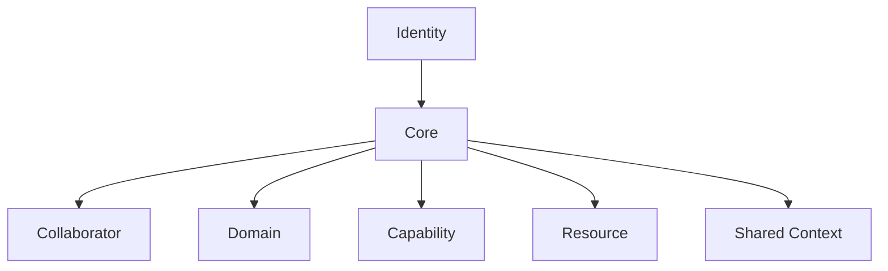
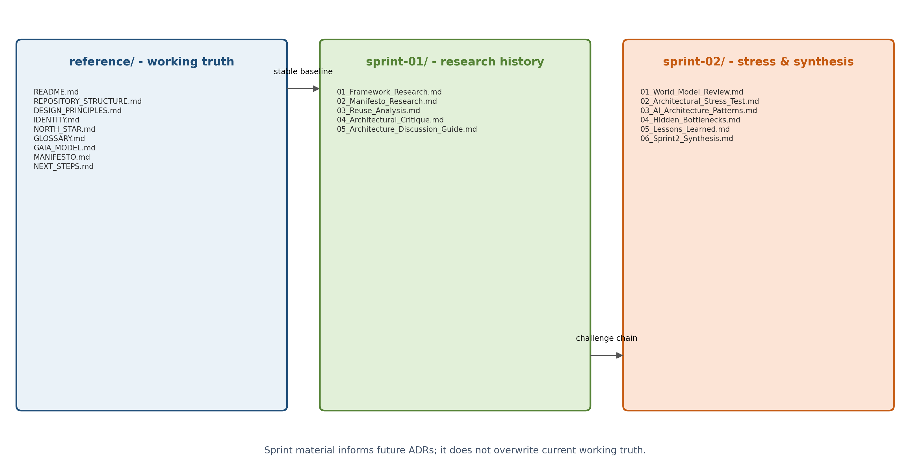

# GAIA

> Local-first Personal AI Operating System

## Document recovery status

- **Document:** `README.md`
- **Recovery approach:** conservative reconstruction
- **Source basis:** surviving GAIA reference documents, repository-structure specification, Sprint 1/Sprint 2 document inventory, and the architecture discussion material
- **Confidence:** high for identity, document roles, repository structure, project phase and declared principles; no claim of byte-for-byte recovery of the lost README
- **Rule applied:** this README introduces and navigates the project. It does not replace the detailed content of `IDENTITY.md`, `GAIA_MODEL.md`, `MANIFESTO.md`, Sprint documents or ADRs.

## What GAIA is

GAIA is a **local-first Personal AI Operating System**.

It is intended to become a personal ecosystem of specialised digital collaborators that helps its owner:

- reduce unnecessary cognitive load;
- coordinate work and context;
- retain useful information intentionally;
- interact with digital and physical systems through explicit capabilities;
- preserve human authority over important decisions and sensitive actions;
- evolve over many years without becoming dependent on a single model, framework, runtime, interface or integration.

GAIA is personal first. Its initial relationship is with a single owner, who remains the source of authority and final decision-maker for important outcomes.

GAIA is local-first not only as a deployment preference, but as a statement about ownership, resilience, privacy, inspectability and control. External and cloud services may be used where they provide value, but they should remain explicit, bounded and replaceable whenever practical.

## What GAIA is not

GAIA is not defined as:

- another chatbot;
- a generic agent framework;
- a workflow automation product;
- a Home Assistant dashboard;
- a model-provider wrapper;
- a cloud assistant;
- a single-purpose Telegram bot;
- a collection of unrelated scripts;
- a plugin marketplace;
- an autonomous replacement for human judgement.

Conversation, workflows, agents, local models, cloud models, memory, automation and external tools may all participate in GAIA. None of them, individually, define its identity.

## Stable identity

The stable identity statement is:

> GAIA is a local-first Personal AI Operating System: a personal ecosystem of specialised digital collaborators that helps the user reduce cognitive load, coordinate context, and act through explicit capabilities while keeping important decisions under human control.

The normative identity document is [`reference/IDENTITY.md`](reference/IDENTITY.md).

## Why the project exists

Personal AI should become useful personal infrastructure rather than disposable interaction.

GAIA starts from several concerns:

- useful AI should not require the user to surrender ownership or control;
- memory should not become accidental accumulation;
- fluent language should not hide important decisions or failures;
- action should be bounded by explicit capability and approval semantics;
- extensibility should not become an uncontrolled collection of plugins and integrations;
- a system maintained by a very small team must remain understandable and recoverable;
- technologies will change, so project identity must remain more stable than implementation.

The foundational declaration is maintained in [`reference/MANIFESTO.md`](reference/MANIFESTO.md).

## Design principles

The current work is guided by these durable principles:

1. **Human First** - important actions and sensitive decisions remain visible, governable and correctable.
2. **Local First** - prefer local ownership, control and execution whenever practical.
3. **Simplicity** - complexity must be justified by validated value.
4. **Replaceability** - models, frameworks, runtimes, channels and integrations must remain replaceable where possible.
5. **Bounded Responsibility** - collaborators and domains need clear scope.
6. **Explicit Capability** - authority must not be implied only by a prompt.
7. **Memory With Intent** - remembered information must be inspectable, correctable and forgettable.
8. **Observability** - important interpretation, retrieval, approval, execution, denial and failure must be understandable.
9. **Sustainable Complexity** - the system must remain maintainable by a very small team.
10. **Identity Over Implementation** - architecture and technology must serve GAIA's identity, not redefine it.

The detailed principles are maintained in [`reference/DESIGN_PRINCIPLES.md`](reference/DESIGN_PRINCIPLES.md).

## Current project phase

GAIA is currently in the **Research and Architecture** phase.

The project has deliberately not committed to a final:

- architecture;
- implementation language;
- agent or orchestration framework;
- runtime abstraction;
- storage model;
- memory architecture;
- planner model;
- plugin model;
- production deployment model.

This is intentional. The immediate objective is to reduce architectural uncertainty before significant implementation commitments define the project by accident.

The maturity roadmap is maintained in [`reference/NEXT_STEPS.md`](reference/NEXT_STEPS.md).

## Current conceptual model

The current official conceptual model contains seven concepts:

- **Identity**
- **Core**
- **Collaborator**
- **Domain**
- **Capability**
- **Resource**
- **Shared Context**




This diagram is conceptual. It does not define runtime flow, data flow, deployment, persistence, ownership rules, orchestration or implementation dependencies.

Memory, Planner, Policy, Approval, Audit, Boundary, Registry, Runtime, Model, Adapter, Tool, Event and Run remain important architectural concerns. They are not automatically first-class elements of the official model until their semantics and boundaries are explicitly validated.

The normative model is maintained in [`reference/GAIA_MODEL.md`](reference/GAIA_MODEL.md).

## Repository organisation

The repository separates current working truth, chronological research, critique, future decisions and unapproved ideas.

```text
.
├── README.md
├── reference/
│   ├── REPOSITORY_STRUCTURE.md
│   ├── DESIGN_PRINCIPLES.md
│   ├── IDENTITY.md
│   ├── NORTH_STAR.md
│   ├── GLOSSARY.md
│   ├── GAIA_MODEL.md
│   ├── MANIFESTO.md
│   └── NEXT_STEPS.md
│
├── sprint-01/
│   ├── 01_Framework_Research.md
│   ├── 02_Manifesto_Research.md
│   ├── 03_Reuse_Analysis.md
│   ├── 04_Architectural_Critique.md
│   └── 05_Architecture_Discussion_Guide.md
│
├── sprint-02/
│   ├── 01_World_Model_Review.md
│   ├── 02_Architectural_Stress_Test.md
│   ├── 03_AI_Architecture_Patterns.md
│   ├── 04_Hidden_Bottlenecks.md
│   ├── 05_Lessons_Learned.md
│   └── 06_Sprint2_Synthesis.md
│
├── adr/
│   ├── ADR-0001-Core-Boundary.md
│   ├── ADR-0002-Memory-Semantics.md
│   ├── ADR-0003-Capability-Model.md
│   ├── ADR-0004-HomeAssistant-Boundary.md
│   ├── ADR-0005-Communication-State.md
│   ├── ADR-0006-Tool-Trust.md
│   ├── ADR-0007-Event-Semantics.md
│   └── ADR_TEMPLATE.md
│
├── incubator/
├── assets/
│   └── diagrams/
└── reports/
```



The detailed current organisation rules are maintained in [`REPOSITORY_STRUCTURE.md`](REPOSITORY_STRUCTURE.md). Historical and recovered structure documents remain available for provenance but are not the current repository-structure authority.

## How to read the repository

### 1. Understand the stable direction

Read:

1. [`reference/IDENTITY.md`](reference/IDENTITY.md)
2. [`reference/MANIFESTO.md`](reference/MANIFESTO.md)
3. [`reference/DESIGN_PRINCIPLES.md`](reference/DESIGN_PRINCIPLES.md)
4. [`reference/NORTH_STAR.md`](reference/NORTH_STAR.md)

These documents define why GAIA exists, what should remain true and which trade-offs should be challenged.

### 2. Understand the current model and vocabulary

Read:

1. [`reference/GLOSSARY.md`](reference/GLOSSARY.md)
2. [`reference/GAIA_MODEL.md`](reference/GAIA_MODEL.md)

These documents define the current vocabulary and conceptual working model. They do not constitute a final architecture.

### 3. Review the research and criticism

Read Sprint 1 in order:

1. [`sprint-01/01_Framework_Research.md`](sprint-01/01_Framework_Research.md)
2. [`sprint-01/02_Manifesto_Research.md`](sprint-01/02_Manifesto_Research.md)
3. [`sprint-01/03_Reuse_Analysis.md`](sprint-01/03_Reuse_Analysis.md)
4. [`sprint-01/04_Architectural_Critique.md`](sprint-01/04_Architectural_Critique.md)
5. [`sprint-01/05_Architecture_Discussion_Guide.md`](sprint-01/05_Architecture_Discussion_Guide.md)

Sprint 1 records research, reuse analysis, first critique and the architecture decision backlog.

Read Sprint 2 in order:

1. [`sprint-02/01_World_Model_Review.md`](sprint-02/01_World_Model_Review.md)
2. [`sprint-02/02_Architectural_Stress_Test.md`](sprint-02/02_Architectural_Stress_Test.md)
3. [`sprint-02/03_AI_Architecture_Patterns.md`](sprint-02/03_AI_Architecture_Patterns.md)
4. [`sprint-02/04_Hidden_Bottlenecks.md`](sprint-02/04_Hidden_Bottlenecks.md)
5. [`sprint-02/05_Lessons_Learned.md`](sprint-02/05_Lessons_Learned.md)
6. [`sprint-02/06_Sprint2_Synthesis.md`](sprint-02/06_Sprint2_Synthesis.md)

Sprint 2 challenges the model using world-model analysis, stress scenarios, architecture patterns, bottlenecks, lessons and anti-patterns.

Sprint documents are historical and analytical artefacts. They must not be rewritten merely to agree with later reference documents. Their purpose is to preserve uncertainty, criticism and alternatives.

### 4. Review explicit decisions

Read the individual files in [`adr/`](adr/).

Each ADR must remain an individual, first-class document. An ADR may be `Proposed`, `Accepted`, `Rejected`, `Superseded` or another explicitly defined state. Proposed ADRs must preserve context, alternatives, trade-offs, evidence requirements and open questions without inventing an accepted decision.

### 5. Review the roadmap

Read [`reference/NEXT_STEPS.md`](reference/NEXT_STEPS.md).

The roadmap progresses through:

- Phase 0 - Research Foundation
- Phase 1 - Architectural Validation
- Phase 2 - Core Prototype
- Phase 3 - First Domain Validation
- Phase 4 - Production Readiness
- Phase 5 - Ecosystem Expansion
- Phase 6 - Long-Term Evolution

Progress is measured by reduced uncertainty and explicit deliverables, not by feature count.

## Relationship with the first domain

Home automation is the first planned validation domain.

The initial domain may use:

- Home Assistant as the home automation boundary and source of operational state;
- Telegram as an initial communication channel;
- local model runtimes as the preferred inference path;
- explicit capability and approval boundaries for physical actions.

The first domain exists to validate GAIA's concepts under real pressure. It must not silently redefine GAIA as a Home Assistant extension, Telegram bot or home dashboard.

Work performed in Zeus and on the GTX 1070 can provide empirical evidence for GAIA. That implementation remains a validation vehicle until architectural decisions explicitly establish a broader role.

## Current architecture questions

The repository intentionally preserves unresolved questions, including:

- What is the smallest coherent Core?
- Which concerns belong inside the Core and which remain external?
- Does GAIA need an explicit Planner?
- Is Memory a Core concern, separate subsystem, domain, resource type or combination?
- What must a Capability contract contain?
- How are policy, approval and audit enforced rather than merely prompted?
- Which components and resources require registries?
- Is Home Assistant an adapter, domain, operational source of truth or delegated runtime?
- Which state belongs to a communication channel and which belongs to GAIA?
- When does orchestration complexity justify adopting an external framework?
- How should Event and Run semantics be defined?
- How is degraded local-first operation validated?
- Can the complete system remain maintainable by a very small team?

These questions belong in Sprint material, validation briefs and ADRs until explicitly resolved.

## Documentation rules

1. Preserve history. Do not rewrite Sprint criticism to match later conclusions.
2. Keep reference documents stable, but not immune to reviewed change.
3. Record major decisions in individual ADRs.
4. Keep unvalidated ideas out of the Core and in the incubator.
5. Store diagram source and rendered output together.
6. Distinguish facts, observations, assumptions, external practice, opinions and decisions.
7. Do not promote framework vocabulary into GAIA-native vocabulary without review.
8. Do not present generated reconstruction as verbatim recovery.
9. Keep documentation useful to a future maintainer with no access to conversation history.
10. Prefer explicit links and traceability over duplicated summaries.

## Contribution and review

Before adding or changing a major concept, ask:

- Does this change GAIA's identity or only its implementation?
- Is this a durable concept or a temporary integration detail?
- Does an existing concept already cover the responsibility?
- What problem and evidence justify the change?
- Which document owns the change?
- Does the change require an ADR?
- What alternative was considered?
- How can the decision be reversed or superseded?
- Does the result remain understandable and maintainable by a very small team?

Changes to identity, official model concepts, capability semantics, memory semantics, Core boundaries, domain boundaries or trust boundaries should be treated as significant architectural events.

## Current status summary

- Foundational identity, manifesto, principles, vocabulary and conceptual-model documents exist.
- Sprint 1 and Sprint 2 preserve research, critique, stress testing and unresolved questions.
- The project remains in Research and Architecture.
- Individual ADRs are required for the next architectural validation stage.
- The first domain is home automation, used as a validation environment rather than the definition of GAIA.
- Final architecture, framework, runtime, memory, storage, planner and production-deployment choices remain deliberately open.

## Next step

The next step is not to build everything.

The next step is to turn the most important unresolved questions into explicit validation briefs and individual proposed ADRs, while using first-domain evidence to reduce uncertainty without allowing the prototype to become the architecture by default.
