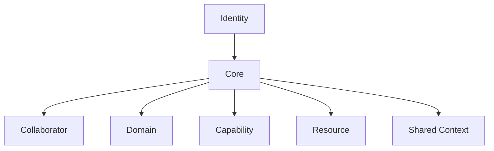

# GAIA Model

## Purpose

This document defines the current official conceptual model. It is not an architecture, runtime, storage, deployment, or framework specification.

## Official concepts

### Identity
The durable definition of what GAIA is and what future architecture must protect.

### Core
The minimal coordination layer that maintains ecosystem coherence and essential contracts. Its internal scope remains under validation.

### Collaborator
A bounded digital role with a named responsibility. It is not automatically an autonomous agent, process, prompt, workflow, or model instance.

### Domain
A coherent area of responsibility. Domains organise concerns without necessarily defining deployment units or plugins.

### Capability
An explicit contract for action or access under defined constraints. It is broader than a function or permission flag.

### Resource
Anything GAIA may read, reference, modify, control, or reason about.

### Shared Context
Scoped contextual information used across parts of GAIA. It is not long-term memory, an audit log, event bus, registry, cache, or arbitrary shared state.

## Candidate concerns not yet promoted

Memory, Planner, Policy, Approval, Audit, Event, Run, Boundary, Registry, Runtime, Model, Adapter, Tool, and Plugin remain important but are not yet first-class official model elements.

## Boundary rules

- Identity is not derived from implementation.
- Core must not absorb everything.
- Collaborators have bounded responsibility.
- Domains remain understandable.
- Capabilities are explicit.
- Resources have scope.
- Shared Context remains controlled.
