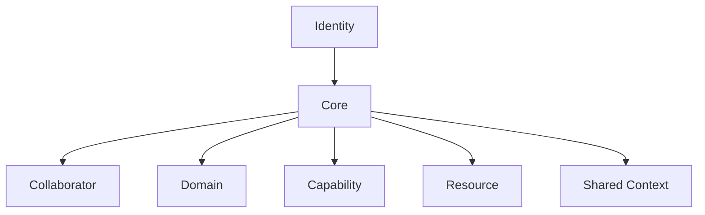

# GAIA Model

**Project:** GAIA  
**Document type:** Reference Model  
**Status:** Proposed  
**Version:** 0.2  
**Supersedes:** `GAIA_MODEL.md`  
**Phase:** Architecture Convergence  
**Last updated:** 2026-08-03

## 1. Purpose

This document defines the current official conceptual model of GAIA.

It identifies the small set of first-class concepts that form the current working model and explains their responsibilities and conceptual boundaries.

It is not an architecture specification and does not define:

- implementation details;
- runtime behaviour;
- storage design;
- framework choices;
- protocols;
- deployment topology;
- programming languages;
- database schemas;
- execution flows.

The model should remain more stable than any framework, model provider, runtime, Adapter, channel, or integration.

## 2. Model authority

This document remains the canonical source for the official first-class conceptual model.

Supporting Foundation Documents may refine the semantics of existing concepts without adding first-class elements automatically:

- `CONTEXT_MODEL_v0.2.md` refines bounded Context semantics;
- `WORLD_MODEL_v0.2.md` refines Resource and source-scoped world-information semantics;
- `ARCHITECTURE_CONVERGENCE_v0.2.md` records convergence status and decision sequencing.

Accepted ADRs may change responsibilities or promote concepts explicitly. Semantic terms introduced by supporting documents are not runtime components or official model elements by default.

## 3. Scope

The official model contains exactly seven first-class concepts:

1. Identity
2. Core
3. Collaborator
4. Domain
5. Capability
6. Resource
7. Shared Context

Other terms, including World Model, Context subtypes, Memory, Knowledge, Planner, Policy, Approval, Audit, Event, Run, Boundary, Registry, Runtime, Model, Adapter, Tool, Observation, Assertion, Relationship, Provenance, Authority, Uncertainty, and World View, are supporting or provisional vocabulary.

They may be formalised later through ADRs or model revisions, but they are not official first-class elements in this version.

## 4. Design intent

The official model is intentionally small. It exists to preserve conceptual clarity while the project learns.

The design intent is to:

- avoid premature abstraction;
- keep implementation details from defining Identity;
- support modular evolution;
- preserve replaceability;
- protect Human Control;
- prevent first-Domain or framework capture;
- remain sustainable for a very small team.

A concept belongs in the official model only when its inclusion reduces durable ambiguity and cannot be represented adequately by existing concepts.

## 5. Canonical conceptual diagram

The arrows show conceptual relationship to the coordination centre. They do not specify ownership, runtime flow, dependency direction, data flow, persistence, orchestration, or deployment.

## 6. Identity

### Definition

Identity defines what GAIA is, what it is not, and what must remain true when technologies, frameworks, Domains, interfaces, and implementations change.

### Responsibility

Identity provides the stable conceptual centre and constrains the architecture.

It answers:

- What is GAIA?
- What is GAIA not?
- What must remain true?
- What must future architecture protect?

### Boundary

Identity is not an implementation model, feature list, framework abstraction, roadmap, or runtime component.

The Core preserves coherence with Identity but does not replace or own it.

## 7. Core

### Definition

The Core is the minimal internal coordination boundary that preserves GAIA's coherence and essential contracts.

Its responsibilities are defined by accepted `ADR-0001-Core-Boundary.md`.

### Responsibility

Conceptually, the Core prevents GAIA from becoming an unstructured collection of scripts, Tools, integrations, and model calls. It provides the stable coordination boundary connecting official model concepts.

The accepted ADR assigns enforcement of required Policy and Approval outcomes to the Core without requiring a general Policy engine.

### Boundary

The Core is not automatically:

- an Agent framework;
- a Workflow engine;
- a Planner;
- a Memory system;
- a World Model service or store;
- a Context database;
- a Policy engine;
- a UI;
- a model runtime;
- a Home Assistant integration;
- a Telegram bot;
- a database;
- a Plugin marketplace.

## 8. Collaborator

### Definition

A Collaborator is a bounded digital role within GAIA that helps with a specific responsibility.

### Responsibility

Collaborators are the primary conceptual units through which GAIA expresses specialised assistance. They prevent the system from becoming one generic assistant with hidden behaviours.

### Boundary

A Collaborator is not automatically:

- an autonomous Agent;
- a separate process;
- a prompt template;
- a Workflow;
- a Tool;
- a Plugin;
- a UI;
- a model instance.

A Collaborator may consume a bounded Context view, use Capabilities, refer to Resources, and produce proposals, but those interactions do not define its implementation form.

## 9. Domain

### Definition

A Domain is a coherent area of responsibility within GAIA.

Examples may include home, research, or communication. **Memory is not currently an established Domain.** Its architectural role remains subject to validation.

### Responsibility

Domains group related concerns so GAIA can grow without making every Collaborator aware of every Resource, Capability, source, and Context.

### Boundary

A Domain is not necessarily:

- a deployment unit;
- a package;
- a Plugin;
- a database schema;
- an external integration;
- one Collaborator;
- a UI section.

The first Home Domain validates the model but does not define all future Domains.

## 10. Capability

### Definition

A Capability is an explicit semantic contract describing what action, access, or operation may be requested or performed.

### Responsibility

Capability provides GAIA's language for possible action and access while preserving explicit boundaries and replaceability.

### Responsibility separation

Capability defines **what**, not **how**.

The following concerns remain conceptually separate:

- **Capability Definition:** what may be requested or performed;
- **Resource Scope:** on what Resource or class of Resources;
- **Policy Decision:** whether it is allowed;
- **Approval:** who or what must authorise it;
- **Execution Binding:** how a Tool, Adapter, Workflow, or external system performs it;
- **Audit Evidence:** what evidence is preserved.

This separation is established by accepted `ADR-0003-Capability-Model_Accepted.md`; it does not prescribe implementation.

### Boundary

A Capability is not merely:

- a function;
- an API endpoint;
- a Tool description;
- a prompt instruction;
- a permission flag;
- an automation script;
- an Approval Workflow;
- an Audit record.

## 11. Resource

### Definition

A Resource is an identifiable subject of observation, reference, reasoning, access, or action within a GAIA Domain.

A Resource may be physical, digital, external, or conceptual, but requires sufficient identity and boundary for GAIA to reason about its state, Relationships, or permitted use.

### Responsibility

Resources provide identifiable subjects and targets for Context, World Model semantics, and Capabilities.

### Resource Reference

A Resource Reference identifies or locates a Resource within a source, Domain, or interaction. The reference is not the Resource itself.

This supporting semantic distinction does not add Resource Reference as a first-class model element.

### Boundary

A Resource is not always a database row, file, device, API object, Memory item, or external service. The exact taxonomy belongs to Domain work and future ADRs only when justified.

Similar names do not prove Resource identity. Ambiguity must remain visible where it affects interpretation or action.

## 12. Shared Context

### Definition

Shared Context is a deliberately selected subset of Context made available across more than one Collaborator or Domain for a bounded coordination purpose.

### Responsibility

It supports cross-boundary coordination without making all Context global.

### Context scopes and views

`CONTEXT_MODEL_v0.2.md` defines:

Primary semantic scopes:

- Request Context;
- Interaction Context;
- Shared Context.

Bounded views:

- Collaborator Context;
- Domain Context.

These scopes and views are supporting semantics, not additional official model elements or mandatory implementation containers.

### Boundary

Shared Context is not:

- long-term Memory;
- a World Model store;
- Audit;
- Event bus;
- Registry;
- cache;
- database;
- unrestricted blackboard;
- permission or Policy bypass.

It must have explicit purpose, scope, Steward, visibility, semantic lifetime, and invalidation.

### Operational persistence

Temporary is a semantic lifetime, not a storage mechanism. Shared or Interaction Context may be persisted operationally for interruption recovery or Approval waits without becoming long-term Memory. Persistence does not authorise reuse outside the original purpose.

## 13. Semantic Foundation: World Model

World Model is a shared semantic model that refines how components describe Resources and source-scoped information about the world.

It may use supporting concepts such as Assertion, Observation, Relationship, Provenance, Authority, Temporal Validity, Uncertainty, Conflict, and World View.

World Model is not:

- an eighth first-class model element;
- a runtime component;
- a service;
- a database or graph;
- a central state store;
- a copy of the world;
- a claim to universal truth.

Components adhere to its semantics where relevant without depending on a single implementation or receiving the complete model.

## 14. Semantic responsibility boundaries

The following distinction is normative:

> **World Model defines meaning. Context defines current relevance. Memory defines retention. Knowledge defines reusable understanding. Audit preserves evidence.**

### Domain View and Domain Context

A Domain View describes what World Model semantics represent for a Domain. Domain Context describes what is currently relevant for a bounded Domain activity.

### Proposal boundary

Context consumption does not mutate world information automatically. A Collaborator may propose an Assertion or Relationship. It becomes accepted only through the appropriate source, Domain Responsibility, deterministic validation, or Human Owner confirmation.

## 15. Conceptual responsibility matrix

| Concept | Primary responsibility |
|---|---|
| Identity | Preserve what GAIA is. |
| Core | Maintain ecosystem coherence and essential contracts. |
| Collaborator | Represent bounded digital responsibility. |
| Domain | Group coherent areas of responsibility. |
| Capability | Define explicit possible action or access. |
| Resource | Identify subjects of observation, reasoning, access, or action. |
| Shared Context | Provide bounded cross-responsibility Context. |

## 16. Accepted boundary rules

- Identity is not derived from implementation.
- The Core does not absorb every cross-cutting concern.
- Collaborators have bounded missions.
- Domains remain understandable and do not become hidden platforms.
- Capabilities are explicit and implementation-neutral.
- Resources have sufficient identity and scope.
- Shared Context remains bounded, stewarded, and non-global.
- Access to Context or world information does not grant execution authority.
- Model inference does not become Fact automatically.
- Channels do not own Interaction Context semantics.
- External systems retain scoped authority for their information.
- First-Domain concepts are not generalised without evidence.

## 17. What the model does not define

This version does not define:

- Memory architecture;
- Knowledge architecture;
- Planner architecture;
- Policy engine or enforcement ownership;
- Approval Workflow;
- Audit model;
- Event model;
- Run lifecycle;
- Registry design;
- runtime abstraction;
- model routing;
- Adapter implementation;
- Tool execution;
- Plugin lifecycle;
- deployment or storage;
- UI;
- Home Assistant boundary;
- Telegram integration;
- local model runtime strategy;
- World Model persistence;
- Context serialisation.

These are valid concerns but remain outside the official model until validated and decided.

## 18. Memory status

Memory is important but remains a provisional concern rather than an official first-class concept or established Domain.

The project has not resolved whether Memory is:

- supporting infrastructure;
- a separate system;
- a layered concern;
- associated with one or more Domains;
- a consumer or producer of Capabilities;
- a retention concern over Resource-related information;
- a combination of these.

`MEMORY_ROLE_VALIDATION.md` should gather evidence before `ADR-0002-Memory-Semantics.md`.

## 19. Known limitations and decision dependencies

The following require further evidence or ADRs:

- exact Core boundary;
- Policy evaluation and enforcement responsibility;
- need for explicit orchestration;
- Memory role and layers;
- Capability governance;
- Resource identity across sources;
- Shared Context governance;
- Collaborator lifecycle and versioning;
- Domain evolution beyond Home;
- Human Approval and Audit;
- operational meaning of local-first;
- need for Event, Run, Registry, or dedicated World Model implementation.

## 20. Relationship with reference documents

| Document | Role |
|---|---|
| `README.md` | Project and repository entry point. |
| `REPOSITORY_STRUCTURE.md` | Repository organisation and lifecycle. |
| `DESIGN_PRINCIPLES.md` | Durable decision constraints. |
| `IDENTITY.md` | What GAIA is and is not. |
| `NORTH_STAR.md` | Long-term direction. |
| `GLOSSARY_v0.2.md` | Vocabulary and maturity status. |
| `CONTEXT_MODEL_v0.2.md` | Context semantics and boundaries. |
| `WORLD_MODEL_v0.2.md` | Shared world-information semantics. |
| `ARCHITECTURE_CONVERGENCE_v0.2.md` | Current convergence and decision sequence. |
| ADRs | Accepted architectural decisions and consequences. |
| Sprint documents | Research, critique, and unresolved evidence. |

## 21. Evolution guidance

A concept may be added to the official model only when:

- it is used consistently;
- it is durable and implementation-independent;
- existing concepts cannot represent it adequately;
- inclusion reduces ambiguity;
- evidence or accepted ADRs support it;
- responsibility is clear;
- maintenance cost is justified.

A concept is not promoted because a framework uses it, implementation introduces it, it is fashionable, it helps one Domain only, or it solves a temporary integration problem.

Major changes to this document normally require an ADR or explicit Architecture Convergence decision.

## 22. Review questions

1. Does the model preserve GAIA's Identity?
2. Are the seven official concepts understandable without implementation knowledge?
3. Is any official concept overloaded?
4. Are semantic supporting terms mistaken for components?
5. Does the Core reflect accepted ADR-0001 while remaining bounded by its explicit exclusions?
6. Are Capability, Policy, Approval, execution, and Audit separated?
7. Are World Model, Context, Memory, Knowledge, and Audit distinct?
8. Does Resource have sufficient identity without introducing Entity prematurely?
9. Would the model survive replacement of the first implementation?
10. Does it remain simple enough for a very small team?

## 23. Final statement

The GAIA Model is a small conceptual reference, not a blueprint.

Its purpose is to preserve coherent language and boundaries while architecture and implementation evolve through evidence.

The official model remains limited to Identity, Core, Collaborator, Domain, Capability, Resource, and Shared Context.

Everything else remains supporting semantics, a provisional concern, or a future architectural decision.
