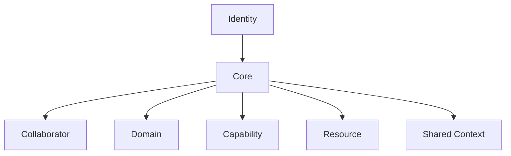

# GAIA Model

## Purpose

This is the current conceptual reference model, not an architecture specification. It deliberately avoids implementation, runtime, storage, protocol, framework and deployment decisions.

## Official concepts

- Identity
- Core
- Collaborator
- Domain
- Capability
- Resource
- Shared Context

## Responsibilities

- Identity preserves what GAIA is.
- Core maintains ecosystem coherence without absorbing every concern.
- Collaborator represents bounded digital responsibility.
- Domain groups related concerns.
- Capability expresses explicit possible action or access.
- Resource represents the object of observation or action.
- Shared Context provides controlled situational awareness.

Memory, Planner, Policy, Approval, Audit, Event, Run, Boundary, Registry, Runtime, Model, Adapter and Tool are important concerns but are not first-class official model elements in this version. They require validation or ADRs.

## Boundary rules

Identity is not derived from implementation. The Core must not absorb everything. Collaborators remain bounded. Domains remain understandable. Capabilities are explicit. Resources have scope. Shared Context must not replace memory, registry, audit or event history.
