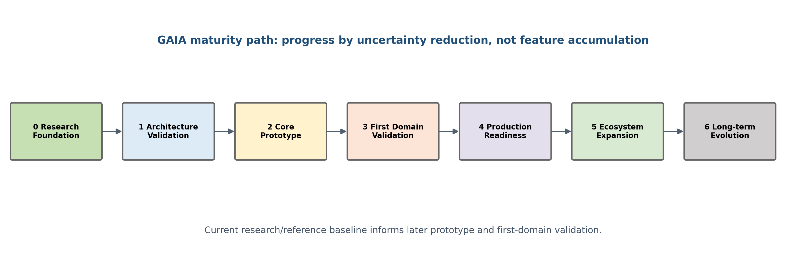

# Next Steps

GAIA advances by reducing uncertainty, not by accumulating features.

## Maturity phases

0. Research Foundation
1. Architectural Validation
2. Core Prototype
3. First Domain Validation
4. Production Readiness
5. Ecosystem Expansion
6. Long-Term Evolution

## Immediate architectural validation

Create proposed ADRs for Core boundary, Memory semantics, Capability model, Home Assistant boundary, Communication state, Tool trust and Event semantics. Pair them with validation briefs that state uncertainty, evidence required and decisions informed.

## Prototype discipline

The smallest Core prototype should expose boundaries among Core, Collaborator, Capability, Resource, Shared Context and external adapters. It should not attempt a general planner, complete memory, plugin ecosystem, full UI, multi-domain orchestration or production security.

## First domain

Home automation is the first validation domain. Home Assistant is the home source of truth, Telegram is an initial channel and local runtime is preferred. The purpose is learning, not feature completeness.
