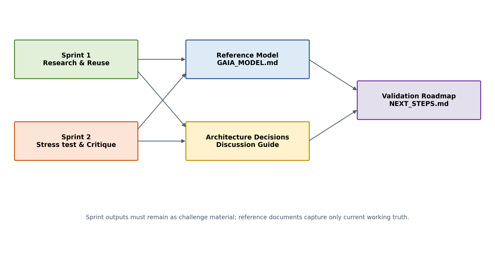

# Sprint 2 Synthesis

## What survived challenge

Identity, local-first intent, bounded collaborators, explicit capabilities, replaceability, human control and a deliberately small conceptual model remain coherent.

## What remains unresolved

Core boundary, memory semantics, planner role, event/run semantics, registry scope, capability governance, Home Assistant boundary, channel state and the threshold for adopting an orchestration framework.

## Direction

Proceed through validation briefs and proposed ADRs. Keep the first domain narrow. Use existing 1070 work as empirical evidence, not as proof of final architecture.

## Exit condition

Sprint 2 is complete when its critiques and open questions are preserved, not when every question is answered.
