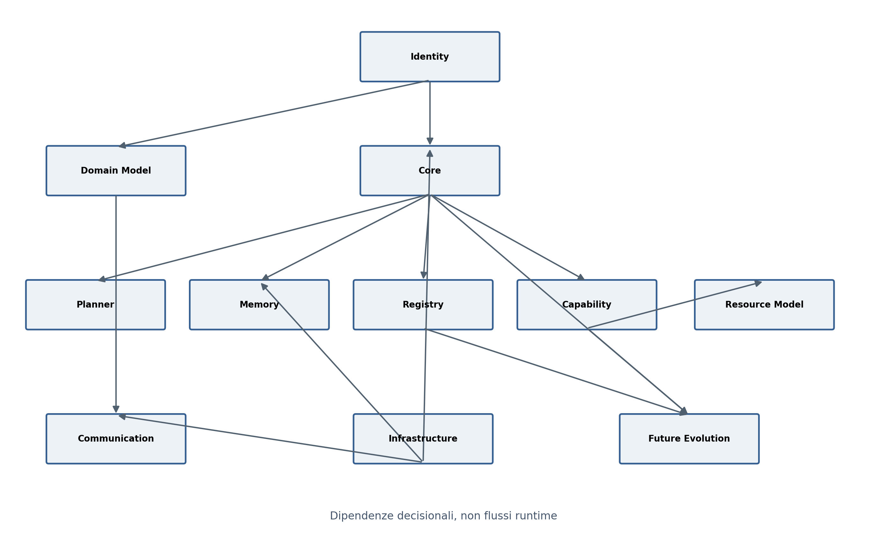
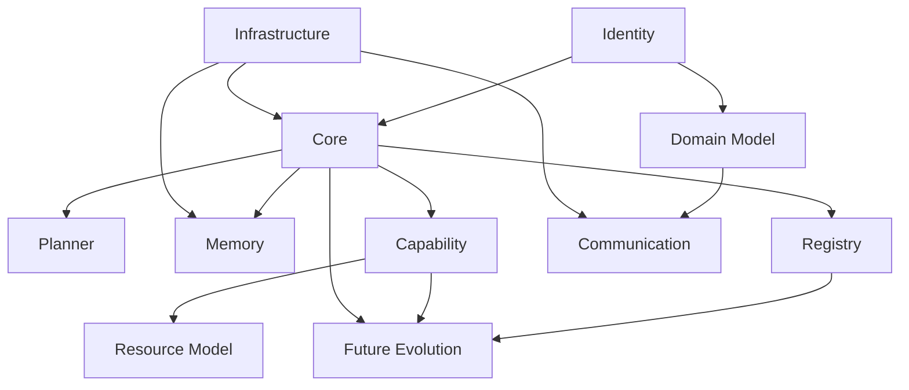

# Architecture Discussion Guide

> Recovery status: Reconstructed  
> Source basis: surviving Sprint references, Architecture Discussion Guide, repository structure specification, and conversation history  
> Confidence: Medium  
> Preservation rule: This file retains its original role. Reconstructed passages are not presented as verbatim recovery.

This guide identifies decisions; it does not make them.

## Critical discussion areas

1. Operational identity of GAIA and practical meaning of local-first.
2. Core boundary and build-versus-reuse for orchestration.
3. Explicit versus implicit planner.
4. Role, correction and deletion semantics of memory.
5. Scope and shape of registries.
6. Capability, permission, approval and resource models.
7. Home Assistant as adapter, domain, source of truth or external runtime.
8. Telegram and communication-state ownership.
9. Infrastructure boundaries across 1070, 3090, Raspberry Pi and NAS.
10. Evolution process for collaborators, domains and external protocols.
