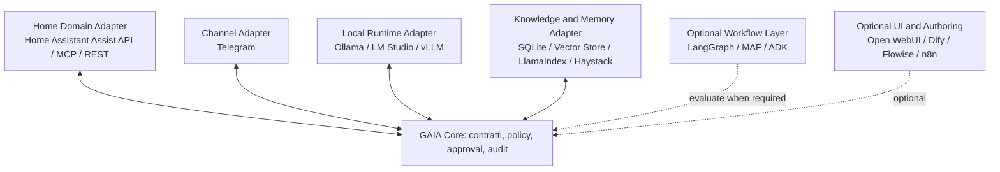

# GAIA Reuse Analysis

**Research Sprint 001**  
**Architectural Reuse Assessment for a Local-First Personal AI Operating System**

- **Version:** 0.2
- **Status:** Consolidated research / decision support
- **Language:** Italiano
- **Owner:** GAIA
- **Supersedes:** `GAIA Reuse Analysis.docx` and `Ricerca comparativa per GAIA.docx`

> Questo documento consolida i due report precedenti senza trasformare ipotesi o raccomandazioni in decisioni architetturali. Le decisioni definitive devono essere registrate tramite ADR.

## 1. Executive Summary

GAIA è un Personal AI Operating System local-first composto da collaboratori digitali specializzati. Lo scopo di questa analisi non è selezionare un framework vincitore, ma determinare quali componenti esterni possano essere riutilizzati senza trasferire al progetto un modello concettuale, un ciclo di vita o un costo operativo non necessari.

Il vincolo dominante è la sostenibilità per un team estremamente piccolo: un maintainer umano supportato da collaboratori AI. Di conseguenza, semplicità, sostituibilità, testabilità, superfici di sicurezza ridotte e manutenzione nel lungo periodo hanno priorità rispetto all'ampiezza funzionale.

### 1.1 Conclusioni forti

1. **Riusare componenti, non adottare uno stack monolitico.** Framework e piattaforme devono restare sostituibili e collocati dietro boundary espliciti.
2. **Non reinventare infrastruttura disponibile.** Home Assistant, Telegram, runtime LLM locali e pipeline RAG possono essere riusati, purché non definiscano l'identità di GAIA.
3. **Mantenere interni i contratti essenziali.** Identità, capability, policy/approval, audit e boundary tra domini non devono dipendere semanticamente da un framework esterno.
4. **Validare prima di astrarre.** MCP, gateway multi-provider, orchestrazione a grafo, registry dinamici e plugin lifecycle non devono essere introdotti prima che un caso reale ne dimostri la necessità.
5. **Ogni dipendenza deve poter essere rimossa.** La sostituzione di un framework, runtime, canale o provider non deve cambiare l'identità del sistema.

### 1.2 Conclusioni ancora deboli

Le seguenti affermazioni restano ipotesi da validare:

- il Core può rimanere minimale;
- l'orchestrazione avanzata può aspettare;
- la memoria può essere trattata soltanto come adapter;
- Telegram può rimanere un semplice canale;
- Home Assistant può rimanere un boundary e non diventare il centro di gravità;
- MCP diventerà uno standard adatto a GAIA;
- Ollama è sufficiente come runtime iniziale per tutti i casi;
- un solo dominio è sufficiente per validare il modello generale.

## 2. Scope e metodo

### 2.1 Tecnologie considerate

L'analisi copre i principali candidati emersi durante la ricerca:

- orchestrazione e agent workflow: LangGraph, Microsoft Agent Framework, Google ADK, CrewAI, AutoGen/AG2;
- agent loop e contratti tipizzati: Pydantic AI, OpenAI Agents SDK, Semantic Kernel;
- knowledge e RAG: LlamaIndex, Haystack;
- UI e workflow authoring: Open WebUI, Dify, Flowise, n8n;
- runtime operativi e coding: OpenClaw, OpenHands;
- runtime LLM: Ollama, LM Studio, vLLM;
- integrazioni e protocolli: Home Assistant, Telegram, MCP, OpenAI-compatible APIs, LiteLLM.

### 2.2 Criteri di valutazione

| Criterio | Domanda di valutazione |
|---|---|
| Semplicità | Riduce o aumenta i concetti nel Core? |
| Accoppiamento | Può essere rimosso senza riscrivere GAIA? |
| Maturità | Offre documentazione, attività e integrazioni credibili? |
| Local-first | Funziona senza cloud obbligatorio? |
| Manutenibilità | È sostenibile per un team molto piccolo? |
| Sicurezza | Espone tool, shell, filesystem o automazioni sensibili? |
| Testabilità | Consente contratti, output e failure mode verificabili? |
| Sostituibilità | Può essere isolato dietro un adapter stabile? |

Il rischio viene espresso qualitativamente come **Basso**, **Medio** o **Alto**. Una scala numerica introdurrebbe falsa precisione.

## 3. Assunzioni architetturali

### 3.1 Assunzioni esplicite

- GAIA è local-first, con cloud opzionale e non fondazionale.
- GAIA non è un chatbot, ma un ecosistema di collaboratori digitali specializzati.
- Il primo dominio di validazione è la domotica, tramite Home Assistant, Telegram e runtime locale.
- Il sistema deve rimanere sostenibile per un team molto piccolo.
- Le azioni ad alto impatto restano sotto controllo umano.
- Framework, provider, canali e runtime non devono definire l'identità del progetto.

### 3.2 Assunzioni da sottoporre a evidenza

- I collaboratori avranno bisogno di memoria, tool e autorizzazioni differenziate.
- La sicurezza non può essere delegata al modello.
- Il primo dominio eserciterà pressione sufficiente sui boundary generali.
- Il costo di mantenere adapter proprietari resterà inferiore al costo del lock-in.

## 4. Strategia generale di riuso

Il diagramma rappresenta boundary concettuali, non un'architettura approvata. Il Core mantiene semantica e contratti; tecnologie esterne implementano funzioni sostituibili.

## 5. Analisi per strato

### 5.1 Core contracts

**Problema:** preservare semantica, responsabilità e coerenza indipendentemente dal framework.  
**Approccio:** build minimal.  
**Da mantenere sotto controllo GAIA:**

- definizione di Collaborator, Domain, Capability e Resource;
- policy e approval semantics;
- audit event essenziali;
- boundary degli adapter;
- errori e failure semantics rilevanti;
- contratti di sostituzione.

Il Core non deve diventare automaticamente un workflow engine, una memoria, un registry universale o un plugin marketplace.

### 5.2 Tool schema e output tipizzati

**Candidati:** Pydantic/JSON Schema; Pydantic AI come implementazione da valutare.  
**Raccomandazione:** reuse + build. Usare strumenti maturi per validazione e serializzazione, preservando contratti GAIA indipendenti.

Pydantic AI è interessante per typing, dependency injection, structured output, tool schema e testabilità. Non è una scelta automatica come orchestratore o runtime centrale.

### 5.3 Runtime LLM locale

**Candidati:** Ollama, LM Studio, vLLM.  
**Raccomandazione:** iniziare con un adapter sottile verso un solo runtime reale. Non introdurre un gateway multi-provider finché non esiste un secondo provider richiesto.

Ollama è il candidato iniziale per disponibilità locale e tool calling, ma local-first non coincide con Ollama. Affidabilità dei tool call, qualità del modello, contesto e prestazioni devono essere misurati sui casi GAIA.

### 5.4 Orchestrazione e workflow

**Candidati principali:** LangGraph, Microsoft Agent Framework, Google ADK.  
**Altri riferimenti:** CrewAI, AutoGen/AG2, Semantic Kernel, OpenAI Agents SDK.

| Candidato | Valore riusabile | Rischio principale | Posizione GAIA |
|---|---|---|---|
| LangGraph | State graph, checkpoint, interrupt/HITL, routing | Il modello a grafo può diventare il modello del Core | Evaluate su workflow reali |
| Microsoft Agent Framework | Workflow tipizzati, state, middleware, checkpoint, telemetry | Dipendenza ampia e possibile orientamento enterprise/cloud | Evaluate, isolato dal Core |
| Google ADK | Agent/workflow ibridi, tool, callback, artifact | Dipendenze e cambi di versione; integrazione locale indiretta | Evaluate su spike comparativo |
| CrewAI | Pattern role-based e crew/flow | Metafora degli agenti può trasferire complessità e autonomia implicita | Reuse as pattern |
| OpenAI Agents SDK | Agent loop, handoff, guardrail, tracing | Provider fit debole per local-first puro | Reuse as design reference |
| AutoGen | Pattern multi-agent ed event-driven | Non preferibile come nuova fondazione | Historical/design reference |

**Decisione differita:** l'orchestrazione a grafo va introdotta soltanto quando task reali richiedono checkpoint, resume, branch espliciti, HITL o coordinamento che un router semplice non gestisce in modo affidabile.

### 5.5 Knowledge, retrieval e memory

**Candidati:** LlamaIndex, Haystack, SQLite/vector store dietro adapter.  
**Raccomandazione:** sperimentare come subsystem separato; non decidere prematuramente che la memoria sia solo un adapter.

| Candidato | Punti di forza | Limite per GAIA |
|---|---|---|
| LlamaIndex | Connector, ingestion, indexing, query engine, agent/RAG | Ampio; può trascinare il proprio modello applicativo |
| Haystack | Pipeline RAG modulari, retriever, document store, integrazione locale | Non risolve orchestrazione e governance complessive |
| Storage minimale | Trasparente, controllabile, facile da cancellare ed esportare | Capacità iniziali limitate |

La validazione deve chiarire se GAIA è principalmente un orchestratore che usa memoria, una memoria personale che usa orchestrazione o un ecosystem collaborator-first. La risposta influenza il centro di gravità del sistema.

### 5.6 Home Assistant

Home Assistant è il primo dominio di validazione e contemporaneamente il maggiore rischio di accoppiamento. Può fornire entity graph, stato, scheduler, automazioni, integrazioni e API. Per questo non deve essere trattato automaticamente come un adapter banale.

**Opzioni da confrontare:**

- Assist API;
- REST/WebSocket API;
- MCP, se maturità e security boundary risultano adeguati;
- integrazione conversation/Ollama, soltanto per esperimenti circoscritti.

**Regola:** Home Assistant resta source of truth del dominio domestico; non deve diventare implicitamente source of truth dell'identità, memoria, policy o stato conversazionale di GAIA.

### 5.7 Telegram

Telegram è il canale iniziale, non il modello conversazionale di GAIA. Introduce sessioni, utenti, autorizzazioni, gruppi, notifiche e threading implicito.

**Test di sostituibilità:** rimuovendo Telegram, intenzioni, stato, approval e contratti del dominio devono restare validi. Se non accade, il canale possiede responsabilità eccessive.

### 5.8 MCP

MCP è promettente come standard di boundary per tool e dati, ma non è una fondazione obbligatoria.

**Da validare:**

- autenticazione e autorizzazione;
- lifecycle e versioning;
- overhead operativo;
- compatibilità dei client;
- failure mode;
- isolamento dei tool;
- costo rispetto a un adapter API diretto.

**Posizione:** evaluate, non assume.

### 5.9 UI, workflow builder e tool broker

| Candidato | Uso potenziale | Da evitare |
|---|---|---|
| Open WebUI | Front-end, laboratorio, knowledge/tool broker | Core GAIA; tool non governati e codice server-side non isolato |
| Dify | Prototipazione workflow/RAG e pubblicazione API | Lock-in del canvas e piattaforma come architettura |
| Flowise | Prototipi visuali, agent flow, HTTP/MCP experiments | Core non versionabile come codice GAIA |
| n8n | Automazioni esterne e integrazioni | Trasformarlo in orchestratore implicito del sistema |
| OpenClaw | Pattern multi-canale e session routing | Adottare interamente il runtime come identità GAIA |

### 5.10 Coding e computer-use runtime

OpenHands può essere considerato in futuro per un collaboratore software, preferibilmente dietro sandbox e policy esplicite. Non è necessario per il primo dominio domotico e non deve essere usato come boundary di sicurezza senza isolamento verificabile.

## 6. Matrice Build / Reuse / Evaluate

| Componente | Scelta iniziale | Implementazione GAIA | Rischio |
|---|---|---|---|
| Core contracts | Build | Contratti e semantica minimi | Medio |
| Tool schema/validation | Reuse + Build | Pydantic/JSON Schema dietro contratti GAIA | Basso |
| Runtime LLM | Reuse | Adapter iniziale verso Ollama | Medio |
| Event/task state minimo | Build | Storage semplice e osservabile | Medio |
| Memory/RAG | Evaluate + Reuse | Adapter verso storage/LlamaIndex/Haystack | Medio-Alto |
| Home Assistant boundary | Reuse + Build adapter | Assist/REST/MCP da confrontare | Alto |
| Telegram channel | Reuse + Build adapter | Stato indipendente dal canale | Medio |
| Policy/approval | Build minimal | Regole esplicite, non prompt-only | Alto |
| Audit | Build minimal | Eventi essenziali e ispezionabili | Medio |
| Graph orchestration | Evaluate later | LangGraph/MAF/ADK su casi reali | Medio-Alto |
| UI | Evaluate later | Open WebUI/Dify/Flowise come strumenti laterali | Medio |
| Multi-provider gateway | Defer | LiteLLM solo dopo un secondo provider reale | Basso ora |
| Coding sandbox | Defer | OpenHands o equivalente in dominio futuro | Alto |

## 7. Boundary e anti-lock-in rules

1. I tipi dominio GAIA non importano tipi framework-specific.
2. Gli adapter traducono tra contratti GAIA e API esterne.
3. Il Core non contiene logica specifica di Telegram, Home Assistant o Ollama.
4. Le capability sono governate da policy applicativa, non soltanto da prompt.
5. Stato conversazionale, audit e memoria non vengono collassati in un unico store.
6. Ogni integrazione dichiara failure mode, timeout, retry e comportamento degradato.
7. Ogni dipendenza rilevante deve avere un test di sostituzione o una exit strategy documentata.
8. Un nuovo layer viene introdotto soltanto dopo evidenza di un problema reale.

## 8. Rischi principali

### 8.1 Core growth

Policy, state, registry, security, audit e migration possono trasformare il Core minimale in un framework. Serve un budget esplicito di responsabilità e una verifica periodica dei boundary.

### 8.2 Centro di gravità non identificato

Il centro di gravità potrebbe essere orchestrazione, memoria, collaborator model, capability ecosystem, event state o Home Assistant. Non va assunto prima di prototipi comparabili.

### 8.3 Capability e plugin explosion

Tool e integrazioni crescono più rapidamente del Core. Capability, permission e lifecycle devono essere validati prima di aprire un plugin ecosystem.

### 8.4 Local-first non operativo

Local-first può significare privacy, resilienza, costo o indipendenza. Ogni significato produce scelte diverse. Il progetto deve tradurlo in requisiti osservabili e test degradati/offline.

### 8.5 Channel ownership

Telegram non deve possedere stato, identità o workflow. Lo stesso principio varrà per futuri canali.

### 8.6 Premature abstraction

LiteLLM, registry universali, MCP ovunque e adapter generici possono anticipare problemi non ancora esistenti e aumentare il costo cognitivo.

## 9. Validation Roadmap

### Fase 1: Domotica end-to-end minima

- Telegram → GAIA → Home Assistant → risposta;
- solo entità esplicitamente esposte;
- azioni reversibili come baseline;
- approval per azioni sensibili;
- audit minimo;
- comportamento offline, denied, ambiguous e unavailable.

### Fase 2: Pressione multi-collaborator

- almeno tre responsabilità/collaboratori distinti;
- più tool con capability esplicite;
- secondo canale o channel simulator;
- verifica se routing semplice è ancora sufficiente;
- misurazione del carico operativo introdotto.

### Fase 3: Memory role validation

- preferenze esplicite;
- memoria breve e conoscenza locale separate;
- provenance;
- correzione, cancellazione ed esportazione;
- confronto tra memory-minimal e memory-central.

### Fase 4: Workflow spike

Confrontare LangGraph, Microsoft Agent Framework e Google ADK sullo stesso scenario che richieda checkpoint, resume, approval e failure recovery. Misurare:

- quantità di codice specifico;
- accoppiamento dei tipi;
- osservabilità;
- facilità di test;
- sostituibilità;
- costo operativo locale.

### Fase 5: Production readiness

- threat model;
- permission/capability model;
- tool trust model;
- plugin lifecycle soltanto se necessario;
- regression tests;
- tool-call evaluation;
- backup e recovery;
- upgrade e rollback.

## 10. Decisioni da trasferire agli ADR

Questa analisi non approva le decisioni seguenti; produce candidati:

- Core boundary;
- memory semantics e centro di gravità;
- capability model;
- Home Assistant boundary;
- communication state indipendente dal canale;
- tool trust e approval;
- event/run semantics;
- condizioni di adozione di un orchestratore esterno;
- condizioni di adozione di MCP;
- condizioni di introduzione di un multi-provider gateway.

## 11. Conclusione

La strategia raccomandata per GAIA è **build the contracts, reuse the edges, validate the centre**.

Il progetto deve costruire soltanto la semantica necessaria a preservare identità, boundary, controllo umano e sostituibilità. Runtime, canali, sistemi di dominio, retrieval e workflow engine devono essere riusati dietro adapter quando il riuso riduce realmente il costo complessivo.

La conclusione più importante non è quale framework adottare. È che il vero centro di gravità architetturale di GAIA deve emergere da evidenza operativa prima che il primo prototipo venga trasformato accidentalmente nell'architettura definitiva.

## Appendix A: Disposition dei documenti sorgente

Dopo la convalida di questa versione:

- `GAIA Reuse Analysis.docx`: sostituito da questo documento; archiviare o eliminare dopo verifica.
- `Ricerca comparativa per GAIA.docx`: contenuto utile consolidato; archiviare o eliminare dopo verifica.
- questo file diventa la versione canonica: `sprint-01/GAIA_Reuse_Analysis.md`.

## Appendix B: Note editoriali

- Le immagini decorative o non editabili dei DOCX non sono state replicate.
- Il diagramma principale è stato ricreato in Mermaid per mantenere il documento versionabile e modificabile.
- Riferimenti a materiale aziendale Restricted non sono inclusi nella versione consolidata personale.
